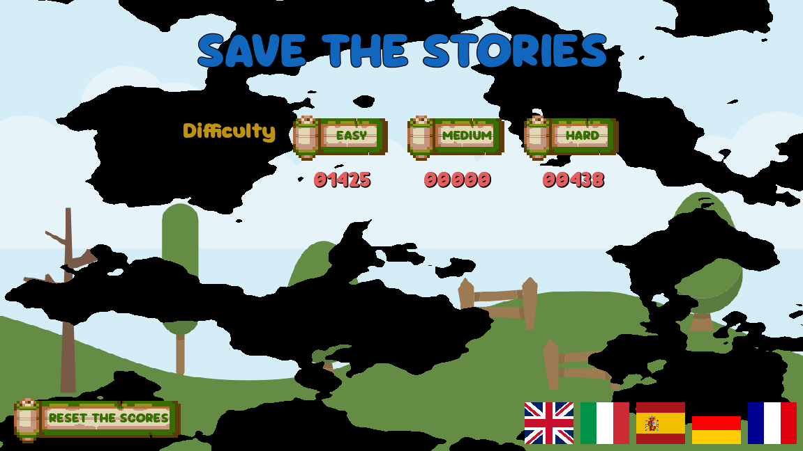
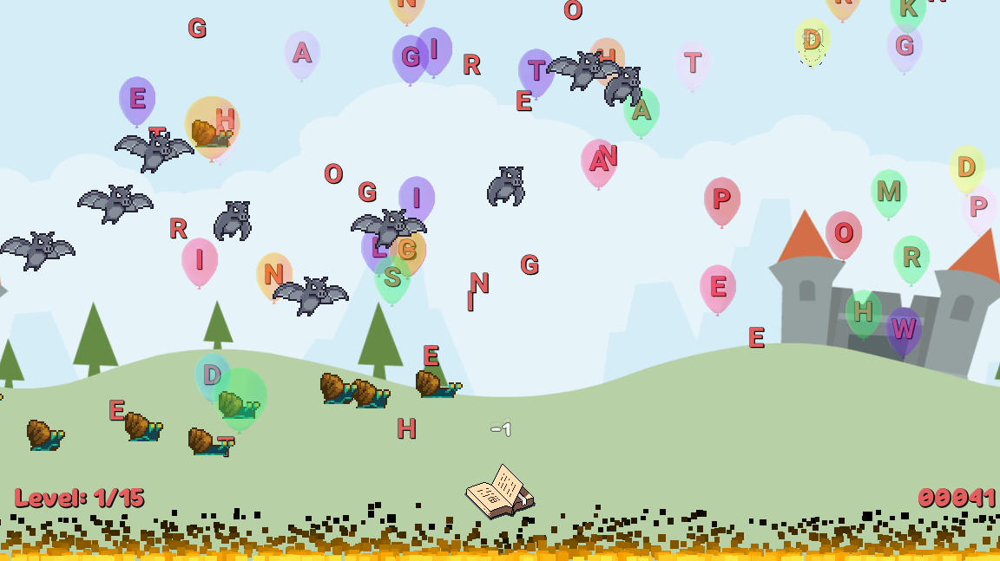

# LetterCatcher

LetterCatcher is an educational game designed to help kids improve their typing skills. The game provides a fun and engaging way for children to practice keyboard usage, enhancing their typing speed, accuracy, and familiarity with the keyboard layout.

Made in Godot 4.3.

Play in browser: https://markod0925.itch.io/lettercatcher

## Game Description

In LetterCatcher, players are presented with falling letters that they must type correctly before the letters reach the bottom of the screen. The game features various levels of difficulty, each with increasing speed and complexity. As players progress through the levels, they encounter different challenges that test their typing abilities.

## Educational Value

LetterCatcher is an excellent tool for teaching kids how to type with the keyboard. The game offers several educational benefits:

- **Improves Typing Speed**: By practicing typing in a fast-paced environment, kids can increase their typing speed over time.
- **Enhances Accuracy**: The game encourages players to type accurately, as incorrect keystrokes result in penalties.
- **Familiarizes with Keyboard Layout**: As players type different letters, they become more familiar with the keyboard layout, making it easier for them to locate keys quickly.
- **Engages and Motivates**: The game's interactive and entertaining nature keeps kids engaged and motivated to practice their typing skills regularly.

## Tips and Strategies for Improving Typing Skills

- **Practice Regularly**: Consistent practice is key to improving typing speed and accuracy.
- **Use All Fingers**: Learn to use all fingers while typing to increase efficiency.
- **Maintain Proper Posture**: Sit up straight and keep your hands and wrists in a comfortable position.
- **Focus on Accuracy First**: Speed will come with time, so focus on typing accurately before trying to type quickly.

## Screenshots

## Art and Design

The game's art and design are inspired by various sources. The assets used in the game are sourced from:

- https://bevouliin.com/doll-ghost-game-asset-sprites/
- https://pixelfrog-assets.itch.io/pixel-adventure-1
- https://ansimuz.itch.io/sunny-land-pixel-game-art

## Sound and Music

The game's sound and music are sourced from various free and open resources. The audio assets used in the game are sourced from:

- [FreeSound](https://freesound.org/)
- [OpenGameArt](https://opengameart.org/)

## Localization

LetterCatcher supports multiple languages, including English, Italian, Spanish, French, and German. The game adjusts the in-game text accordingly to the user Language selected.

## How to Play

1. Start the game and select a difficulty level.
2. Letters will start falling from the top of the screen.
3. Type the letters correctly before they reach the bottom.
4. Progress through the levels and improve your typing skills.

## How to Contribute

We welcome contributions to the LetterCatcher project! Here are some ways you can contribute:

### Adding Stories

1. Create a new story in the format used in the `stories.dat` file.
2. Ensure the story is appropriate for the game's target audience.
3. Submit a pull request with your new story added to the appropriate section of the `stories.dat` file.

### Adding Languages

1. Translate the game's text into a new language (e.g., `XX`) modifying `Assets/translations.csv`.
2. Open Godot Editor: it will automatically create a new `Assets/translations.XX.translation` file.
3. Add the new translation file to the project (Project->Project Settings...->Localization->Translation->Add).
4. Add new stories in the `stories.dat` file creating a new `XX` entry in the JSON file.
5. Add the new flag icon of `XX` into assets.
6. Add the flag button of `XX` to the `start_screen.tscn` scene, assign the proper flag icon, and connect the pressed signal to a new function that calls set_locale().
7. Submit a pull request with your new translations.

### Reporting Issues

If you encounter any issues or bugs while playing the game, please report them on the project's GitHub issue tracker. Provide as much detail as possible to help me understand and resolve the issue.

### Suggesting Features

If you have ideas for new features or improvements to the game, feel free to suggest them on the project's GitHub issue tracker. I appreciate your feedback and suggestions!

### Code Contributions

1. Fork the repository and create a new branch for your changes.
2. Make your changes and ensure they are well-documented.
3. Submit a pull request with a clear description of your changes and why they should be merged.

Thank you for contributing to LetterCatcher!
